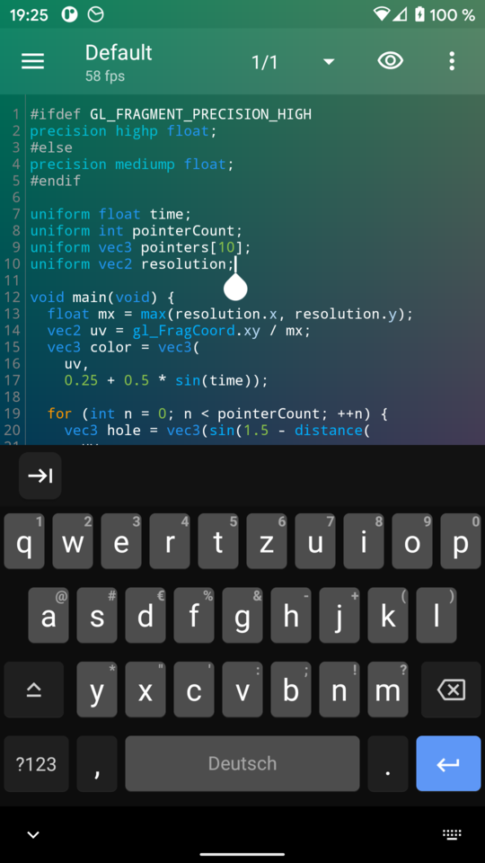

# Shader Editor

Create and edit [GLSL](https://en.wikipedia.org/wiki/GLSL) shaders on
your Android phone or tablet and use them as live wallpaper.

## Screenshots

## Download

 

## Features

* Live preview in background or on an extra screen
* Syntax highlighting
* Error highlighting
* Use any shader as live wallpaper
* Exposure of sensors (camera, accelerometer, gyroscope, magnetic field,
	light, pressure, proximity)
* Exposure of battery level
* Supports wallpaper offset
* Supports multiple touches
* Supports multiple render resolutions
* Previous rendered frame in backbuffer texture
* Import and use arbitrary textures
* Create and use cube maps
* Disables rendering when battery is low

See [FAQ.md](FAQ.md) for frequently asked questions.
